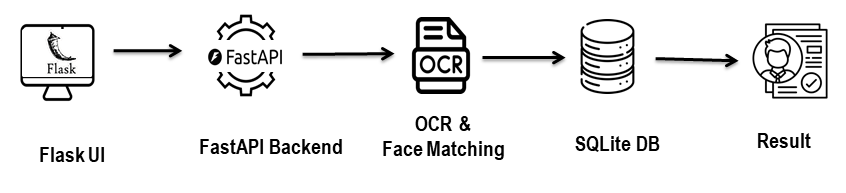
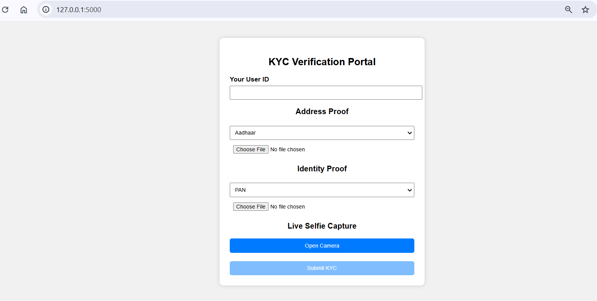
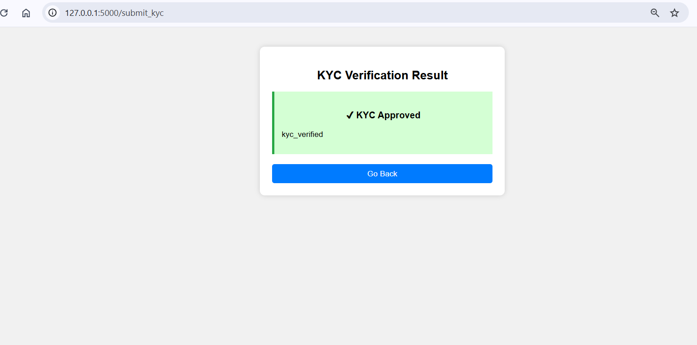
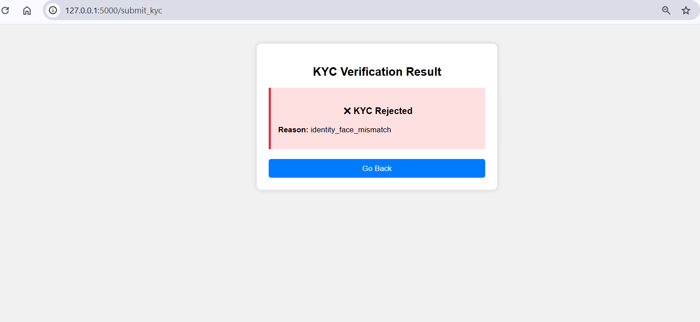

# Digital KYC Verification System

A lightweight AI-powered KYC verification pipeline that validates user identity using document OCR (Optical Character Recognition), image quality checks, and selfie-to-document face matching. Built with FastAPI, Flask, OpenCV, and Tesseract OCR.

Vision : To simplify digital KYC using automation, improving accuracy, speed, and user trust.
## 🚀 Features

- Upload Address Proof, Identity Proof, and Selfie
- OCR-based document type detection (Aadhaar, PAN, Passport, Voter ID)
- Image quality evaluation (blur, brightness, sharpness)
- Face detection and matching using:
- ORB feature matching
    - SSIM (Structural Similarity Index Measure)
    - Histogram correlation
    - Edge correlation
- Automatic decision engine: Approve / Reject
- SQLite-based attempt tracking (fraud prevention)
- FastAPI backend + Flask frontend interface

## ⚙️ Tech Stack
- **Backend**: FastAPI, OpenCV, Tesseract OCR, NumPy, Pillow
- **Frontend**: Flask
- **Database**: SQLite
- **Other**: Python-Multipart, Scikit-Image



This KYC verification system uses a simple Flask frontend that lets users upload their address proof, identity proof, and selfie. These files are sent to a FastAPI backend, where OCR extracts text and OpenCV performs face detection and multi-metric face matching using SSIM, histogram correlation, ORB, and edge similarity. SQLite tracks user attempts and validation stages. The backend returns approval or rejection, completing a lightweight, fully automated e-KYC workflow.

## 🧪 API Endpoint
**POST /verify_kyc**
**Input**
- user_id (string)
- address_doc_type (Aadhaar / Passport / Voter_ID)
- identity_doc_type (PAN / Aadhaar / Passport)
- address_proof (file)
- identity_proof (file)
- selfie (file)

Returns:
    Approved/Rejected:
    <details>
    <summary>Click to view sample API response</summary>

    ```json
    {
        "status": "approved/rejected",
        "reason": "kyc_verified",
        "details": {
          "identity_compare": {
            "orb": {...},
            "ssim": {...},
            "hist_corr": {...},
            "edge_corr": {...},
            "decision": true
            },
          "address_compare": {...},
            "ocr": {
            "address_detected": "AADHAAR",
            "identity_detected": "PAN"
            }
        }
    }```
</details> 

## Demo Flow

- Select Address Proof Type
- Upload Address Proof
- Select Identity Proof Type
- Upload Identity Proof
- Upload Selfie
- Get Instant Result: Approved / Rejected

## Screenshorts

- Upload Page (KYC Form Page): This page allows users to enter their User ID and upload Aadhaar/PAN documents along with a live selfie. It provides a clean interface for initiating KYC verification quickly and easily.


- KYC Approved Page: After successful verification, the user sees a green approval screen confirming their identity match and document authenticity. It provides reassurance and a smooth transition after completing the KYC process.


- KYC Rejected Page: If verification fails, the system displays a rejection screen highlighting the reason. This transparent feedback helps users understand what went wrong and guides them to re-attempt KYC correctly.


- Backend(FastAPI): The backend provides an interactive FastAPI Swagger UI where users can upload KYC documents, test the /verify_kyc API, view validation responses, and inspect detailed face-matching results in real time.   


## 🚀 Future Enhancements

- To improve accuracy, usability, and scalability, several enhancements can be implemented in future versions:
- ML-based Face Recognition: Replace OpenCV heuristics with deep-learning models for higher verification accuracy.
- Improved OCR Pipeline: Use advanced OCR engines and noise reduction for better text extraction.
- Cloud Deployment: Host the backend on AWS/GCP with CI/CD automation.
- Role-Based Dashboard: Provide admin analytics, verification history, and user monitoring.
- Multi-language Support: Enable OCR and interface support for multiple Indian languages.


